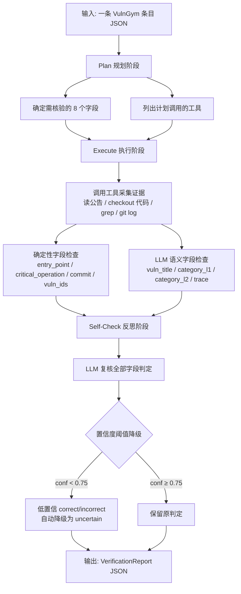

# VulnGym T1 数据自动化验证系统 — 设计文档

***

## 开发过程记录

本项目采用 “**先澄清、再拆分、后实现、持续验证**” 的开发方式。正式编码前，先把题目的文字要求转换为可检查的工程契约：8 个核心字段都必须独立给出 `correct / incorrect / uncertain`、证据和置信度；正常路径整体应同时覆盖公告与源码；缺少证据时必须说明缺口并降级为 `uncertain`；公开集、训练集和隐藏集的使用边界也必须提前冻结。这样可以避免开发到后期才发现 “报告能生成，但字段含义、指标口径或异常行为不满足题意”。

### 1. 以 GitHub Issue 和 DAG 管理工作拆分

在需求和现有原型审查完成后，将开发总纲整理为一个父 Issue，并按 “共享契约 — 底层工具 — 字段能力 —Agent 编排 — 交付验收” 的依赖顺序拆分为子 Issue。每个 Issue 都明确写入背景、范围与非目标、文件所有权、输入 / 输出契约、`Blocked by` / `Blocks` 关系、测试命令、验收标准、风险和回滚点；GitHub 创建后的实际 Issue 编号再回填到总纲中。拆分依据不是按文件或个人习惯随意分工，而是以下四个维度：

* **依赖关系**：输入 / 输出 schema、分类本体和错误模型属于所有模块共同依赖，先作为 I1 冻结；本地公告与 Git 只读工具属于 I2；只有 I1、I2 明确后，确定性字段检查（I3）和 LLM 语义判定（I4）才有稳定的输入与证据格式。

* **职责边界**：I3 只负责代码、行号、commit、漏洞 ID 等可由本地证据决定的事实；I4 只负责标题、分类、trace 等语义判断和模型失败降级；I5 只负责将已验证的能力编排为 Plan → Execute → Self-Check，避免 Agent 层反向改写底层事实。

* **文件所有权与集成风险**：每个 Issue 预先限定可改文件。例如 schema、工具、字段检查器、LLM 客户端、Agent、CLI、评测器和文档分别归属不同 Issue，降低多人同时修改同一核心文件导致的冲突，也使 PR 审查可以围绕一个明确的行为增量进行。

* **可验收性**：每项能力都绑定可重复运行的 fixture、单元测试或 CLI smoke，而不是仅凭 “代码已写完” 关闭 Issue。标准档与 Bonus 也分开管理：I1–I8 构成 Standard 主链；错误归因、修正建议、多语言适配（I9–I11）是非阻塞的 Bonus 扩展。

由此得到的主 DAG 为：`I1 → I2 → (I3 ∥ I4) → I5 → (I6 ∥ I7) → I8`；I9/I10/I11 在 I5 完成后可作为独立增强并行推进。这里的并行并不等于盲目地同时改代码：只有前置依赖已解除、文件所有权不重叠、分支基于最新集成分支，且每项工作都能独立提交测试和运行结果时，才适合分配到不同 worktree/Agent。这样的切分带来三个直接好处：一是从父 Issue 的依赖图即可直观看到当前进度和真正的阻塞点；二是没有共同依赖、没有文件冲突的任务可并行执行，缩短整体周期；三是失败可以定位到一个小的可回滚 Issue，不会把 schema、LLM、CLI 和文档问题混在一次大改动里排查。

### 2. 先用 Grillme 质询方案，再确定实现边界

开发过程中大量使用 Grillme 对设计进行前置质询，而不是把它当作直接产出代码的工具。每次准备新增模块或扩大范围时，先围绕尚未决策的 “前沿问题” 进行讨论：题目的 Standard 与 Bonus 边界在哪里；哪些字段必须由公告 / 源码 / Git 的确定性证据决定；LLM 可以判断什么、绝不能覆盖什么；本地缓存缺失是否足以判错；commit 与受影响版本如何建立可验证关系；没有独立 gold 时哪些数字只能称为运行统计、不能称为准确率或召回率；以及并发是否真的必要、会引入哪些缓存和超时风险。

这一步的产物是清晰的决策树和可写入 Issue 的验收条件，而不是一段未经验证的 “实现思路”。例如，经过质询后将 “每个字段都必须同时引用公告和源码” 修正为 “正常报告整体覆盖两类来源，单字段引用最适合它的证据”；将 “缓存读取失败即判 incorrect” 修正为 “信息不足则 uncertain”；将 Standard 阶段的并发降为后续增强，优先保证顺序处理、可复现日志和失败隔离。这样能提前暴露隐含假设，减少实现完成后才返工修改接口、指标口径或证据规则的风险。

### 3. 以 TDD 驱动小步实现和回归

在实现阶段遵循 TDD 的 **Red → Green** 小循环：先在已约定的公共边界写一个能够失败的行为测试，再只实现使该测试通过的最小代码，随后运行相关测试并在稳定后整理代码。测试面向可观察行为，而不是私有函数或内部调用顺序；期望值来自题目契约、公告 / 源码 fixture 或独立 gold，而不是在测试中重复一遍被测实现的算法。

本项目的主要测试边界包括：输入 JSONL 到结构化报告的 schema 边界；公告、Git 和文件读取工具的只读 / 失败返回边界；8 个字段检查器的三态和证据边界；LLM 的结构化解析与超时 / 非法 JSON 降级边界；Agent 的 plan、真实 tool trace 和 self-check 边界；以及 CLI 的批处理、单条坏输入隔离和评测指标边界。每次修复都会先补充对应的反例，例如行号漂移、代码片段不匹配、坏 commit、公告 404、缺字段、分类别名、LLM 超时和修复 commit 被误当漏洞 commit 等，再让实现满足该反例。

这种按垂直切片推进的方式，使每一项改动都能同时交付行为、证据和回归保护：既不会因为一次性写完大量 “想象中的测试” 而脱离真实接口，也不会在功能演示成功后才发现异常路径没有覆盖。最终，确定性字段优先由只读工具生成可复现证据，LLM 仅处理标题、分类和链路等语义判断；当公告、代码或模型不可用时统一降级为 `uncertain`，从流程上避免将信息不足误判为错误或编造证据。

自建的skills：
improvement-priority:让其提改善建议的skill：因为我发现AI只会列方案，不会排序；特别是个人是后端，想优化前端的页面的时候其实很实用
---
name: improvement-priority
description: 对开发中的改造建议做排序。用于需要比较多个改造方案优先级时，重点考虑改造效果越高越好、改造幅度越小越好、改造风险越低越好，并将每项都分为高/中/低后再排序。
---

对改造建议做排序。

规则：
- 改造效果分为：高 / 中 / 低
- 改造幅度分为：低 / 中 / 高
- 改造风险分为：低 / 中 / 高

排序原则：
- 优先选择改造效果高的
- 在效果接近时，优先选择改造幅度小的
- 在效果和幅度接近时，优先选择风险低的

输出要求：
- 每条建议都标注：
  - 改造效果：高 / 中 / 低
  - 改造幅度：高 / 中 / 低
  - 改造风险：高 / 中 / 低
- 按优先级从高到低排序输出
- 每条建议只用一句话说明排序原因
- 不要输出空泛的大改方案，优先输出当前上下文下能直接落地的建议

debug-safely:让其debug的skill。因为我发现有时自己给的bug信息不够。或者是说的不清楚，他就直接开始修，最后导致越修越乱。比如之前我不清楚错误的原因就一直跟他说改改改，导致一直改不成功，最后让他说明可能的原因和对应文件，自己明白原因从cursor切换codex，说明原因和文件后一下子就改好了
---
name: debug-safely
description: 用于开发时排查和修复 bug。用户提到 bug、报错、异常、问题复现失败、修了还不对等情况时使用。要求先问清楚疑惑点，再说明 bug 产生原因，再做最小范围修复，不要动其他代码，不能引入回归，最后必须做测试验证。
---

排查和修复 bug。

规则：
1. 先问清楚疑惑的点，再开始分析和修改
2. 先说明 bug 产生的原因，让用户知道 bug 是什么、怎么产生的
3. 只修改和这个 bug 直接相关的代码，不要动其他代码
4. 修复时不能引入回归
5. 修复后必须做测试验证

工作方式：
- 如果信息不够，先问清楚：
  - 期望行为是什么
  - 实际现象是什么
  - 怎么复现
  - 有没有报错信息、日志、截图、堆栈
- 在没搞清楚原因前，不要盲改代码
- 先给出原因分析，再给出修复方案，再实施修改
- 默认采用最小改动原则，不顺手重构，不顺手改无关代码

输出要求：
- 先写清楚疑惑点或缺失信息
- 再写清楚 bug 原因
- 再写清楚准备怎么修
- 最后说明做了什么测试、测试结果是什么
  
AGENT.md:
编码规范:项目所有文件固定编码格式为 UTF-8，禁止使用其他编码格式，保证跨平台、跨工具的兼容性。
SQL 开发规范:1生成数据库表时，必须为表、字段添加清晰的中文注释，明确表用途、字段含义;2注释需简洁准确，确保团队成员可直接通过注释理解表结构与业务含义。
沟通与回复规范:所有文档、沟通、代码注释、问题回复统一使用中文，禁止使用非必要的英文表述。
基本工作流：
基本工作流：使用 Girll Me 加开会讨论，确认产品边界；sepc 管理文档和逐步实现和拆分 task 文档（背景 + 后端、前端的实施任务 + 测试 + 验收标准），TDD 去根据 task 实现代码，然后有 bug 用上述自建 skills 处理。
AI 工具的使用：cursor 负责代码生成编写，codex 负责文档撰写、验收标准、测试用例编写以及问题 Debug 排查。

***

## 一、系统架构

### 1.1 主流程

系统采用 **Plan → Execute → Self-Check** 三阶段 Agent 闭环，对每条漏洞数据条目进行字段级自动化审核。

### 1.2 核心设计原则

| 原则                  | 实现方式                                                                |
| ------------------- | ------------------------------------------------------------------- |
| **确定性优先**           | entry\_point /critical\_operation/commit /vuln\_ids 由代码精确匹配，不依赖 LLM |
| **语义字段 LLM 判定**     | vuln\_title /category/trace 由 LLM 结合公告与代码证据做语义判断                    |
| **拿不准就说 uncertain** | 置信度低于 0.75 的 correct/incorrect 自动降级为 uncertain，避免硬下结论               |
| **证据可追溯**           | 每个字段判定附带 evidence\_refs（source + locator + quote），可回溯到原文 / 代码       |
| **失败安全降级**          | LLM 超时 / 异常时自动降级为 SafeLLMClient，返回 uncertain，不编造答案                  |

***

## 二、工具设计

### 2.1 VulnGymTools（Agent 调用的只读工具）

系统通过 `VulnGymTools` 类提供 6 个只读工具，覆盖公告、源码、Git 三类证据源：

| 工具                   | 用途                                                 |
| -------------------- | -------------------------------------------------- |
| `read_advisory`      | 读取漏洞公告 JSON，获取标题、CWE、受影响版本、CVE/GHSA 编号             |
| `checkout`           | 切换到漏洞 commit，读取对应版本源码                              |
| `read_file_lines`    | 读取指定文件行号范围，核验 entry\_point /critical\_operation 代码 |
| `grep_code`          | 正则搜索关键函数、危险操作位置                                    |
| `git_log`            | 确认 commit 存在性、查看提交信息                               |
| `git_tags_at_commit` | 尝试将 commit 关联到发布版本 tag                             |

**安全约束**：所有工具均为只读操作，不执行受检仓库代码，不修改仓库状态。运行期网络访问被离线守卫阻断并记录。

***

## 三、Prompt 设计

语义字段的 Prompt 设计遵循三个核心原则：

1. **结构化输出约束**：要求 LLM 返回固定 JSON `{status, confidence, evidence}`，`status ∈ {correct, incorrect, uncertain}`，非法 JSON 自动降级为 uncertain。

2. **证据注入**：Prompt 中注入工具采集的事实（公告标题、CWE、taxonomy 允许值、trace 节点摘要），让 LLM 基于证据判断而非自由发挥。

3. **版本化管理**：每个 Prompt 携带 `[PROMPT_VERSION=key@ver]` 前缀，便于审计与回放。

共 5 个 Prompt 模板：`vuln_title_judge`、`vuln_category_l1_judge`、`vuln_category_l2_judge`、`trace_overall_judge`、`self_check_judge`。其中四个语义字段（title /l1 /l2 /trace）合并为一次 `semantic_bundle` 批量调用，减少 LLM 请求次数，要求每个字段独立判定不得互相推导。

***

## 四、运行过程

### 4.1 输入与输出

* **输入**：JSONL 文件，每行一条 VulnGym 条目（含 entry\_id、report\_id、entry\_point、critical\_operation、commit、vuln\_ids、vuln\_title、vuln\_category\_l1/l2、trace 等字段）。

* **输出**：JSONL 文件，每行一条 VerificationReport，包含 8 个字段的独立判定（status + confidence + evidence）、整体 verdict、工具调用追踪、自检结论。

### 4.2 单条处理流程

**Plan 阶段**：解析条目，确定需核验的 8 个字段，列出计划调用的工具列表（read\_advisory → checkout → read\_file\_lines → grep\_code → git\_log → git\_tags\_at\_commit），生成 plan 记录。

**Execute 阶段**：

1. 调用 `read_advisory` 获取公告事实（标题、CWE、受影响版本、CVE/GHSA）。

2. 调用 `checkout` 切换到条目指定的 commit，建立代码快照。

3. **确定性字段检查**（不调用 LLM）：

* `entry_point`：用 `read_file_lines` 读取指定文件行号，检查函数名 / 签名是否匹配。

* `critical_operation`：用 `grep_code` + `read_file_lines` 检查危险操作代码是否存在。

* `commit`：用 `git_log` 确认 commit 存在，用 `git_tags_at_commit` 尝试关联版本。

* `vuln_ids`：对比公告中的 CVE/GHSA 与条目中的 vuln\_ids 列表。

1. **语义字段检查**（一次 LLM 批量调用）：将公告事实、taxonomy 约束、trace 节点摘要注入 Prompt，同时判定 vuln\_title、vuln\_category\_l1、vuln\_category\_l2、trace 四个字段。

**Self-Check 阶段**：将 8 字段判定结果 dump 给 LLM 做独立复核，输出 `{agree, comment}`。若复核发现矛盾，触发受限复核流程。

**置信度阈值降级**：对 status 为 correct/incorrect 但 confidence < 0.75 的字段，自动降级为 uncertain，并在 evidence 中追加降级说明。

### 4.3 工具调用统计

在 20 条测试集上，平均每条调用 **9.9 次工具**，其中：

* `git show`（读文件 / 查 commit）：平均 8.4 次 / 条

* `git log`：1 次 / 条

* `git tag`：1 次 / 条

* `git cat-file`：1 次 / 条

所有工具调用均为只读，无网络访问，无仓库修改。

***

## 五、运行效果

### 5.1 整体结果（公开测试集 20 条）

| 指标             | 数值                                                         |
| -------------- | ---------------------------------------------------------- |
| 整体 verdict 分布  | correct: 5 (25%) / incorrect: 7 (35%) / uncertain: 8 (40%) |
| Self-Check 完成率 | 20/20 (100%)                                               |
| Schema 合法率     | 20/20 (100%)                                               |
| 工具调用失败率        | 0/198 (0%)                                                 |
| 平均工具调用次数       | 9.9 次 / 条                                                  |

### 5.2 各字段表现

| 字段                  | 判定方式   | correct | incorrect | uncertain | 说明                    |
| ------------------- | ------ | ------- | --------- | --------- | --------------------- |
| entry\_point        | 确定性    | 20      | 0         | 0         | 行号 + 函数名精确匹配，稳定可靠     |
| critical\_operation | 确定性    | 20      | 0         | 0         | 代码内容匹配，稳定可靠           |
| commit              | 确定性    | 20      | 0         | 0         | commit 存在性验证，稳定可靠     |
| vuln\_ids           | 确定性    | 20      | 0         | 0         | CVE/GHSA 编号对比，稳定可靠    |
| vuln\_title         | LLM 语义 | 15      | 1         | 4         | 标题语义对比，多数准确           |
| vuln\_category\_l1  | LLM 语义 | 5       | 5         | 10        | 分类边界模糊，主要短板           |
| vuln\_category\_l2  | LLM 语义 | 8       | 2         | 10        | 依赖 l1 判定，连带 uncertain |
| trace               | LLM 语义 | 12      | 0         | 8         | 链路传播合理性判断             |

### 5.3 关键发现

**代码类字段（entry\_point /critical\_operation/commit /vuln\_ids）20/20 全对**。这四个字段由确定性代码逻辑处理，不依赖 LLM，只要工具能正常读取文件和 git 信息，判定结果稳定可复现。

**分类字段（vuln\_category\_l1/l2）是最大短板**。20 条中各有 10 条 uncertain，主要原因是 business\_logic 与 access\_control 的分类边界模糊，LLM 在缺乏明确 CWE 映射时倾向于给出低置信度判定。此外，1 条数据因 GLM API 超时导致 4 个语义字段全部降级为 uncertain (0.20)。

**uncertain 比例偏高（40%）** 的设计取舍：系统采用置信度阈值 0.75 作为降级线，宁可标 uncertain 也不硬给 correct/incorrect。这保证了已给出的 correct/incorrect 判定有较高置信度，但也意味着部分边界案例被保守地归入 uncertain。

### 5.4 鲁棒性

* LLM 超时 / 异常：自动降级为 SafeLLMClient，返回 uncertain，不崩溃、不编造。

* 公告缺失：字段标记为 uncertain 并说明原因。

* commit 不存在：标记为 incorrect 并给出反证。

* 输出 schema 校验：每条结果经过 JSON Schema 校验，非法输出自动修复或标记。
