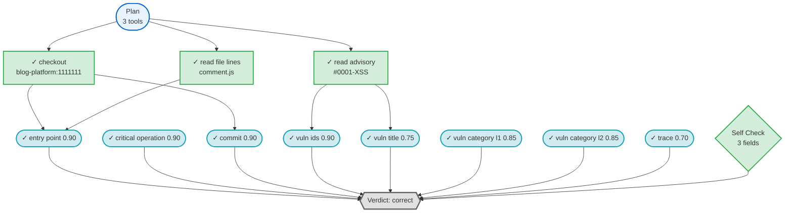

# I10 Bonus: 推理链路可视化

## 概述

推理链路可视化模块将验证报告中的推理过程（工具调用、证据关联、字段验证）转换为直观的流程图，帮助理解 agent 的决策逻辑和调试验证失败的原因。

## 功能特性

### 1. 单报告可视化

将单条 `VerificationReport` 的推理过程转换为 Mermaid 流程图，展示：
- **规划节点 (Plan)**: Agent 计划使用的工具和字段
- **工具节点 (Tool)**: 实际调用的工具及其成功/失败状态
- **字段节点 (Field)**: 8 个字段的验证结果（correct/incorrect/uncertain）
- **反思节点 (Self-Check)**: 反思验证结果
- **判定节点 (Verdict)**: 最终整体判定
- **证据关联边**: 工具输出到字段验证的证据链

### 2. 多报告对比

批量可视化多条报告，生成：
- 每条报告的独立流程图文件
- 跨报告的统计对比（verdict 分布、平均工具数、失败率等）
- 汇总对比报告

### 3. 增强功能

- **过滤器**: 按 verdict 或失败工具数过滤报告
- **统计分析**: 推理链路的统计指标（工具覆盖率、失败率等）
- **多格式输出**: Markdown、纯 Mermaid、JSON 图结构
- **详细信息**: 失败工具的错误信息、错误字段的证据

## 使用方法

### 命令行工具

#### 可视化单条报告

```bash
python -m bonus.visualization.cli \
  --reports out/reports_e2e.jsonl \
  --report-id entry-00001 \
  --output chain.md
```

**输出**: `chain.md` 包含完整的 Markdown 文档，包括摘要、Mermaid 流程图和详细信息。

#### 可视化所有报告

```bash
python -m bonus.visualization.cli \
  --reports out/reports_e2e.jsonl \
  --output-dir out/chains/
```

**输出**: 
- `out/chains/entry-00001.md`
- `out/chains/entry-00002.md`
- ...
- `out/chains/comparison.md` (汇总对比)

#### 只可视化错误报告

```bash
python -m bonus.visualization.cli \
  --reports out/reports_e2e.jsonl \
  --output-dir out/chains/ \
  --filter-verdict incorrect
```

#### 只可视化有失败工具的报告

```bash
python -m bonus.visualization.cli \
  --reports out/reports_e2e.jsonl \
  --output-dir out/chains/ \
  --filter-failed-tools 1
```

#### 生成对比报告

```bash
python -m bonus.visualization.cli \
  --reports out/reports_e2e.jsonl \
  --comparison comparison.md
```

#### 显示统计信息

```bash
python -m bonus.visualization.cli \
  --reports out/reports_e2e.jsonl \
  --stats
```

**输出示例**:
```
=== 推理链路统计 ===

总报告数: 4

Verdict 分布:
  - Correct:   1
  - Incorrect: 3
  - Uncertain: 0

平均指标:
  - 每报告工具数: 2.50
  - 每报告失败工具数: 0.25

覆盖率:
  - 包含 Plan: 4 (100.0%)
  - 包含 Self-Check: 4 (100.0%)

总错误字段数: 4
```

#### 输出纯 Mermaid 格式

```bash
python -m bonus.visualization.cli \
  --reports out/reports_e2e.jsonl \
  --report-id entry-00001 \
  --output chain.mermaid \
  --format mermaid
```

### Python API

```python
from bonus.visualization import ChainVisualizer
import json

# 加载报告
reports = []
with open("out/reports.jsonl", "r") as f:
    for line in f:
        reports.append(json.loads(line))

# 创建可视化器
visualizer = ChainVisualizer()

# 可视化单条报告
markdown = visualizer.visualize_report(reports[0], output_format="markdown")
print(markdown)

# 保存到文件
visualizer.save_visualization(reports[0], "chain.md", output_format="markdown")

# 批量保存
visualizer.save_multiple(reports, "out/chains/", output_format="markdown")

# 获取统计信息
stats = visualizer.get_chain_statistics(reports)
print(f"总报告数: {stats['total_reports']}")
print(f"平均工具数: {stats['avg_tools_per_report']:.2f}")

# 按 verdict 过滤
incorrect_reports = visualizer.filter_by_verdict(reports, "incorrect")
print(f"错误报告数: {len(incorrect_reports)}")

# 按失败工具过滤
failed_reports = visualizer.filter_by_failed_tools(reports, min_failures=1)
print(f"有失败工具的报告数: {len(failed_reports)}")
```

## 输出格式

### Markdown 文档结构

```markdown
# Reasoning Chain: entry-00001

**Report ID**: GHSA-DEMO-0001-XSS
**Verdict**: `correct`

## Summary

- **Total Tools**: 3
- **Failed Tools**: 0
- **Total Fields**: 8
- **Incorrect Fields**: 0
- **Has Plan**: Yes
- **Has Self-Check**: Yes

## Reasoning Flow



## Details

(详细的失败工具和错误字段信息)
```

### JSON 图结构

```json
{
  "entry_id": "entry-00001",
  "report_id": "GHSA-DEMO-0001-XSS",
  "verdict": "correct",
  "nodes": [
    {
      "id": "plan",
      "type": "plan",
      "label": "Plan\\n3 tools",
      "status": "success",
      "confidence": 0.0,
      "metadata": {
        "tools_planned": ["read_advisory", "checkout", "read_file_lines"],
        "fields_planned": ["entry_point", "critical_operation", "commit"]
      }
    },
    {
      "id": "tool_1",
      "type": "tool",
      "label": "read advisory\\n#0001-XSS",
      "status": "success",
      "confidence": 0.0,
      "metadata": {
        "seq": 1,
        "tool": "read_advisory",
        "ok": true,
        "error": null
      }
    }
    // ... 更多节点
  ],
  "edges": [
    {
      "from": "plan",
      "to": "tool_1",
      "label": "plan"
    },
    {
      "from": "tool_1",
      "to": "field_vuln_ids",
      "label": null
    }
    // ... 更多边
  ],
  "metadata": {
    "has_plan": true,
    "has_self_check": true,
    "total_tools": 3,
    "failed_tools": 0,
    "total_fields": 8,
    "incorrect_fields": 0
  }
}
```

## 节点类型与样式

### 节点类型

| 类型 | 形状 | 描述 |
|------|------|------|
| Plan | 圆角矩形 `([])` | 规划节点 |
| Tool | 矩形 `[]` | 工具调用 |
| Field | 圆形 `([])` | 字段验证 |
| Self-Check | 菱形 `{{}}` | 反思节点 |
| Verdict | 六边形 `{{{}}}` | 最终判定 |

### 状态颜色

| 状态 | 颜色 | 描述 |
|------|------|------|
| Success | 绿色 | 工具调用成功 |
| Failed | 红色 | 工具调用失败 |
| Correct | 蓝色 | 字段验证正确 |
| Incorrect | 红色 | 字段验证错误 |
| Uncertain | 黄色 | 字段验证不确定 |

## 使用场景

### 1. 调试单条验证失败

```bash
# 可视化失败的报告
python -m bonus.visualization.cli \
  --reports out/reports.jsonl \
  --report-id entry-00003 \
  --output debug.md

# 查看流程图，定位失败原因
# - 哪个工具失败了？
# - 哪个字段判定错误？
# - 证据链是否完整？
```

### 2. 审计 Agent 决策逻辑

```bash
# 生成所有报告的可视化
python -m bonus.visualization.cli \
  --reports out/reports.jsonl \
  --output-dir audit/

# 检查：
# - Plan 中规划的工具是否都执行了？
# - 工具调用顺序是否合理？
# - Self-Check 是否对所有字段进行了反思？
```

### 3. 对比不同 Agent 版本

```bash
# 可视化 v1 版本
python -m bonus.visualization.cli \
  --reports v1/reports.jsonl \
  --output-dir v1/chains/

# 可视化 v2 版本
python -m bonus.visualization.cli \
  --reports v2/reports.jsonl \
  --output-dir v2/chains/

# 对比工具使用、失败率、字段准确率
```

### 4. 生成报告附件

```bash
# 为每条错误报告生成可视化
python -m bonus.visualization.cli \
  --reports out/reports.jsonl \
  --filter-verdict incorrect \
  --output-dir report_attachments/

# 附加到错误分析报告中
```

## 测试

运行测试套件：

```bash
# 运行所有可视化测试
pytest tests/test_visualization.py -v

# 运行特定测试
pytest tests/test_visualization.py::test_chain_builder_correct_report -v

# 使用真实数据测试
pytest tests/test_visualization.py::test_real_reports_e2e -v -s
```

### 测试覆盖场景

1. **ChainBuilder 测试**
   - 正确报告的链路构建
   - 错误报告的链路构建
   - 元数据提取

2. **MermaidRenderer 测试**
   - 基本 Mermaid 语法生成
   - Markdown 文档生成
   - 失败工具的渲染

3. **ChainVisualizer 测试**
   - 单报告可视化（多格式）
   - 按 verdict 过滤
   - 按失败工具数过滤
   - 统计信息生成

4. **真实数据测试**
   - 使用 `reports_e2e.jsonl` 的真实报告
   - 验证所有报告都能成功可视化

## 架构设计

### 模块职责

```
bonus/visualization/
├── __init__.py             # 包导出
├── chain_builder.py        # 推理链路构建
│   ├── ChainNode           # 节点数据类
│   ├── ChainEdge           # 边数据类
│   ├── ReasoningChain      # 链路数据类
│   └── ChainBuilder        # 构建器主类
├── mermaid_renderer.py     # Mermaid 渲染
│   ├── MermaidRenderer     # 基础渲染器
│   └── ComparisonRenderer  # 对比渲染器
├── visualizer.py           # 高级 API
│   └── ChainVisualizer     # 可视化器主类
└── cli.py                  # 命令行入口
```

### 处理流程

```
VerificationReport (JSON)
    ↓
[ChainBuilder] 解析 tool_trace、fields、plan、self_check
    ↓
ReasoningChain (图结构: nodes + edges)
    ↓
[MermaidRenderer] 渲染为 Mermaid 语法
    ↓
Markdown / Mermaid / JSON 输出
```

## 扩展指南

### 添加新的输出格式

在 `visualizer.py` 中扩展 `visualize_report()`:

```python
def visualize_report(self, report: Dict[str, Any], 
                    output_format: str = "mermaid") -> str:
    chain = self.builder.build(report)
    
    if output_format == "graphviz":
        return self._render_graphviz(chain)
    elif output_format == "html":
        return self._render_interactive_html(chain)
    # ... 现有格式
```

### 自定义节点样式

在 `mermaid_renderer.py` 中修改样式常量：

```python
class MermaidRenderer:
    # 自定义颜色
    STYLE_SUCCESS = "fill:#custom,stroke:#custom,stroke-width:2px"
    # ...
```

### 添加新的过滤器

在 `visualizer.py` 中添加过滤方法：

```python
def filter_by_confidence(self, reports: List[Dict[str, Any]], 
                        min_confidence: float) -> List[Dict[str, Any]]:
    """按最低置信度过滤"""
    # 实现逻辑
```

## 限制与约束

1. **只读分析**: 不修改核心模块（`agent.py`、`field_checkers.py`）
2. **后处理**: 只分析已有报告，不重新运行验证
3. **Bonus 隔离**: 所有代码在 `bonus/` 目录，不影响 Standard 功能
4. **向后兼容**: 不修改 `VerificationReport` 契约

## 性能考虑

- **内存**: O(N×M) 其中 N 为报告数，M 为平均节点数（≈15）
- **时间复杂度**: O(N×M) 构建 + O(N×M) 渲染
- **建议**: 超大数据集（>1000 条）可分批处理或只可视化关键报告

## 常见问题

### Q: Mermaid 图在某些 Markdown 查看器中不显示？

部分查看器不支持 Mermaid。推荐使用：
- GitHub/GitLab（原生支持）
- VS Code + Markdown Preview Mermaid Support 插件
- Typora
- 在线工具: https://mermaid.live

### Q: 如何导出为图片？

使用 Mermaid CLI:
```bash
npm install -g @mermaid-js/mermaid-cli
mmdc -i chain.mermaid -o chain.png
```

### Q: 能否与 CI 集成？

可以。在 CI 中生成可视化作为报告附件：

```bash
python -m bonus.visualization.cli \
  --reports $REPORTS_PATH \
  --output-dir artifacts/chains/

# 上传 artifacts/chains/ 作为 CI artifact
```

### Q: 如何自定义节点标签？

修改 `chain_builder.py` 中的 `_summarize_input()` 方法，自定义工具输入的摘要格式。

## 贡献者

- I10 Bonus Issue 实现
- 不影响 Standard Issue (I1-I8) 交付
- 参考 I9 (错误归因) 的 Bonus 隔离模式
